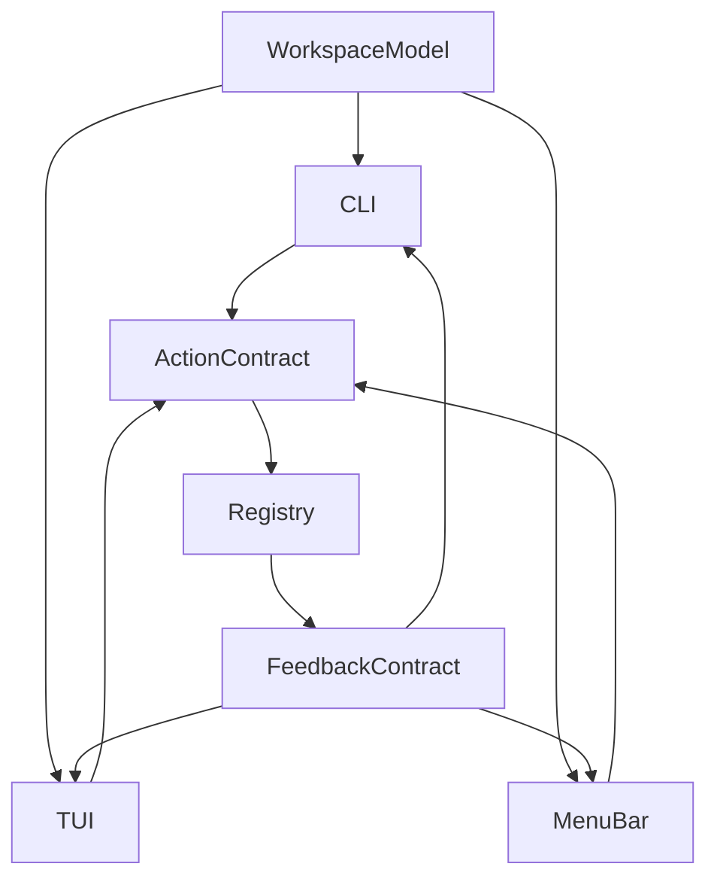

# Grove Redesign Spec (MenuBar First)

Status: Proposed  
Priority: MenuBar first, then CLI/TUI parity

## Goals

- Make Grove feel sane by reducing mode-switching and ambiguity.
- Align CLI, TUI, and MenuBar around one interaction contract.
- Preserve speed for power users while improving first-run discoverability.

## Product Interaction Contract

### Canonical entities
- **Worktree**: branch + path identity.
- **Server**: runtime process attached to a worktree.
- **Workspace** (UI model): worktree plus optional server state and activity metadata.

### Canonical actions
- `start`: starts server for a worktree context.
- `stop`: stops running server.
- `restart`: canonical named action for safe restart.
- `open`: opens server URL if running.
- `logs`: opens stream/snapshot for selected workspace/server.

### Feedback contract
Every async action in any surface must expose:
- `pending` (visible immediately at point of action)
- `success` (state change confirmation)
- `error` (message + one concrete next step)

## MenuBar IA Redesign

### Current issue summary
- One dropdown currently carries too much complexity (search, sectioning, row actions, shortcut monitor, error queue, toasts, context menus).

### Proposed IA
1. **Header strip**
   - Global health pill (running/crashed/unhealthy count)
   - Refresh
   - Open Logs
   - Open Settings

2. **Primary list: Workspaces**
   - One row per workspace with compact status chips.
   - Primary row action only: `open` when running, `start` when stopped.
   - Secondary actions in a deterministic overflow menu.

3. **Status + feedback rail**
   - Inline per-row pending/error/success state.
   - Single global message area for background/system errors.

4. **Advanced actions moved out**
   - Keep Logs in dedicated window.
   - Keep settings/preferences in Settings window.
   - Keep heavy management operations in CLI/TUI.

## MenuBar Component Boundaries

Proposed decomposition from current `MenuView` monolith:

- `MenuShellView`
  - Layout and high-level sections only.
- `MenuHeaderView`
  - Global summary, refresh, logs/settings.
- `WorkspaceListView`
  - Search, grouping, list rendering.
- `WorkspaceRowView`
  - Row display + single primary action + overflow menu.
- `GlobalMessageBanner`
  - User-facing system errors/warnings.
- `ActionFeedbackStore`
  - Source of truth for pending/success/error states.

Service boundaries:
- `ServerManager` keeps orchestration/CLI IPC only.
- New view model layer mediates UI state (selection, search, grouping, keyboard navigation).

## MenuBar Interaction Rules

1. **Single primary action rule**
   - Row tap/enter always does the most likely next action.
2. **No hidden critical shortcuts**
   - Keyboard behavior must be visible in one help surface.
3. **No duplicate error channels**
   - Replace split `error` + queue patterns with one message bus.
4. **Scope must be real**
   - `menubarScope` setting must directly filter data source before rendering.

## CLI/TUI Consistency Spec

### Copy and help rules
- Never show `grove start <name>` unless command supports that signature.
- Prefer explicit recovery guidance:
  - bad: "not running"
  - good: "Server is stopped. Run `grove start` from `<path>` or `grove restart <name>`"

### Keybinding and docs parity
- Define one canonical key table in code and publish from that source to docs.
- TUI should either:
  - support README keys (`enter/space/o`), or
  - README should reflect current keys (`s/x/b`) and explain alternatives.

### Restart semantics
- TUI restart path should reference `grove restart <name>` behavior, not start-by-name guidance.

## Cross-Surface Flow Diagram

## Acceptance Criteria for This Spec

- MenuBar has explicit component boundaries and reduced responsibility per view.
- CLI/TUI user guidance uses correct command semantics.
- One canonical vocabulary and one canonical action contract are documented.
- Scope/filter settings in UI map to concrete filtering behavior.
- Every action path defines pending/success/error states.

## File Mapping for Implementation

### Primary implementation targets
- `menubar/GroveMenubar/Sources/GroveMenubar/Views/MenuView.swift`
- `menubar/GroveMenubar/Sources/GroveMenubar/Services/ServerManager.swift`
- `menubar/GroveMenubar/Sources/GroveMenubar/Views/SettingsView.swift`
- `cli/internal/tui/app_enhanced.go`
- `README.md`

### Secondary targets
- `menubar/GroveMenubar/Sources/GroveMenubar/Views/ServerGroupView.swift`
- `menubar/GroveMenubar/Sources/GroveMenubar/Models/ServerGroup.swift`
- `cli/internal/cli/discover.go`
- `cli/internal/cli/root.go`
